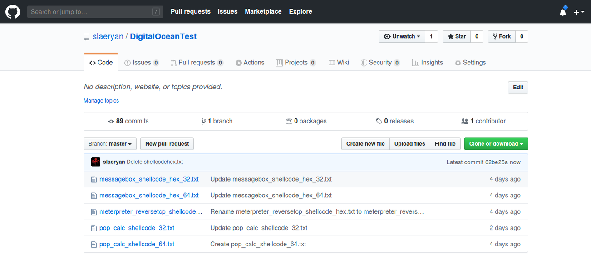

# Introducing FalconZero v1.0 - an undetectable, targeted Windows implant for delivering second-stage payloads to the host machine

<p align="center">
  
</p>

**Reading Time:** _16 minutes_

## Warning Ahead!
You could dominate the world if you read this post from top to bottom and follow all the instructions written here. Proceed at your own discretion, operator!


## TL;DR
This tool is [](https://GitHub.com/Naereen/) for red team operators and offensive security researchers and ergo, being made open source and free(as in free beer).

It is available here: [https://github.com/slaeryan/FALCONSTRIKE](https://github.com/slaeryan/FALCONSTRIKE)

## Demo
Let's take a quick look at a demo of the _FalconZero Implant Generation Utility_ and then we shall get down to the technicalities.

<script id="asciicast-xGZ7B6Vn2byMWniewydzQCEco" src="https://asciinema.org/a/xGZ7B6Vn2byMWniewydzQCEco.js" async></script>

## Introduction
Ever since I completed my SLAE, I am completely enchanted by the power of shellcode. This feeling was only augmented when I heard a podcast by the wonderful guys at FireEye's Mandiant Red Team where they advocated the usage of shellcode in red teaming engagements for it's flexibility and it's ability to evade AV/EDRs among other things.

That's when I decided to play around with various shellcode injection techniques. Along the way, I thought of a ***cool*** technique and made an implant based on it that could deliver Stage-2 payloads to the target machine in a stealthy manner. 
But why stop there? Why not add some neat features to it and create a framework to aid red teamers to generate these implants as quickly and cleanly as possible.

That was the inception of the _FALCONSTRIKE_ project and _FalconZero_ is the first public release version Loader/Dropper of the _FALCONSTRIKE_ project. It implements the **BYOL(Bring Your Own Land)** approach as opposed to **LotL(Living off the Land)**.
But it's not your standard run-off-the-mill shellcode loader(more on this later).

You may think of _FalconZero_ as a loading dock for malware. In other words, _FalconZero_ is comparable to an undetectable gun that will fire a bullet(payload) on the host machine.

This is the reason it may not be classified as a malware per-se but rather a facilitator of sorts that helps the malware get undetected on the host.

## But there's plenty of tools that already do that. So what makes _FalconZero_ special?
While there are many excellent existing projects, this is not designed to be a replacement for them.

This is designed to be unique in its own way and there are quite a few of those features that separate it from the rest. So let's discuss them one by one.
### Separation of the final-stage payload from the Loader
As the real attackers often do, we need to separate the payload into 2 stages:

1. Stage-1 payload - A stealthy, lightweight Loader - downloads and injects the Beacon shellcode into a benign host process.
1. Stage-2 payload - A full-fledged interactive C2 Agent - Meterpreter/Beacon etc.

Some of the ways of storing the Stage-2 payload(shellcode) in the Stage-1 payload(Dropper) are:

1. Storing shellcode in .text section of Dropper
1. Storing shellcode in .data section of Dropper
1. Storing shellcode in .rsrc section of Dropper etc.

While these techniques remain quite popular but keeping both the shellcode and Dropper bundled together(even if its encrypted) is probably not a good idea from an OPSEC & risk management perspective.

Why risk combining all the functionality into a single tool?

Imagine if the blue-teams get a hold of an undetonated implant, not only will the Dropper get compromised but also the Stage-2 payload which can't be any good. Instead, hosting the Stage-2 payload on a server is beneficial because you even have a kill-switch in your hands now(say you want to stop the op. simply delete the payload from the server and that's it).

This technique also helps us to evade some AV/EDRs if the Stage-1 implant is designed in such a way since Stage-2 has more chances of getting detected.

So it's best practise from an OPSEC and risk mitigation perspective to separate the Dropper and the shellcode over network. In other words, the Dropper can connect to a remote server where the shellcode is hosted provided some conditions are met, fetch it from over there, prep it and then proceed to inject it into a host process on-the-fly which is exactly what has been implemented. Remember BYOL? Hopefully it makes a lot more sense now.
### Usage of Github for fetching the Stage-2 payload
Yep! You read that correctly. Github is used as the payload storage area. 
The implant connects to the appropriate Github repository and fetches the payload from there.



Why such a choice?

Simply because [Github](https://github.com) is largely considered a legitimate website and network traffic observed to Github will **not be flagged as malicious by security products** and will probably not even be blocked in most organisations/offices as opposed to using some attacker-owned web server hosting a payload which could be noisy as hell.

Last time I checked, I could not find any publicly available tools that utilised Github as the shellcode docking station so this would be the first of it's kind.
I sincerely hope Github doesn't ban me from their platform now :)

As a brownie point, this would save the operator precious time and money too ;)
### Sensitive string obfuscation
All the sensitive strings in this implant are encrypted using XOR algorithm with a key that is commonly found in binaries. This would make the job of extracting the URL string and other information from the binary using static analysis impossible.

Feel free to test it using [FLOSS](https://github.com/fireeye/flare-floss/releases/download/v1.5.0/floss-1.5.0-GNU.Linux.zip). Extract it, chmod +x and test using:

```hta
./floss <binary>
```

### Implant targeting
test
### Killdate
Think of killdates like a sort of expiry date for implants beyond which the implant will simply not execute. Obviously, this is quite an important feature as you'd want your implants to be rendered useless after the engagement ends.
### Address Of Entry Point Injection technique
Thanks to [@spotless](https://twitter.com/spotless), _FalconZero_ utilises a shellcode injection technqiue that goes under the radar of many AV/EDRs since we do not need to allocate RWX memory pages in the host process which is a very noisy action.

Quoting from his blog,

```hta
This is a shellcode injection technique that works as follows:
1. Start a target process into which the shellcode will be injected, in suspended state. 
2. Get AddressOfEntryPoint of the target process
3. Write shellcode to AddressOfEntryPoint retrieved in step 2
4. Resume target process
```

Credit goes to Mantvydas Baranauskas for describing this wonderful technique!

## AV Scan of the implant


[VT Scan Results](https://www.virustotal.com/gui/file/987505a6c969112378bd074b43fb474710ad1d50c07c96a3b9dfb87e7f94a2c8/detection)

[Intezer Analyze Results](https://analyze.intezer.com/#/analyses/32930dbf-0bb4-4817-a682-75b3e87bbddb)
