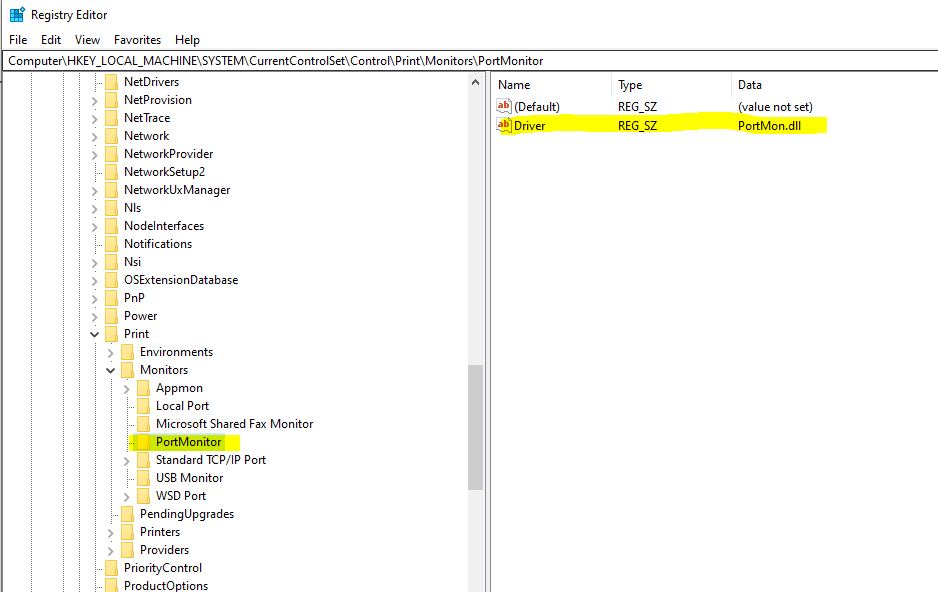
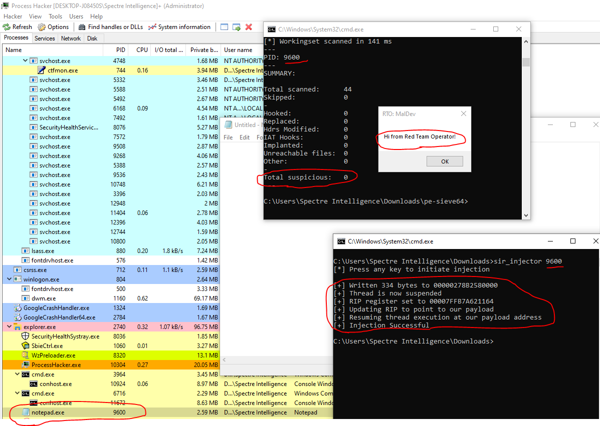
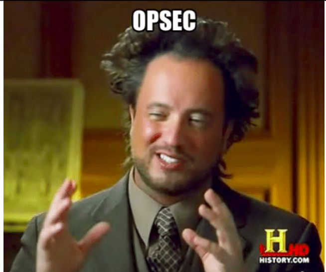
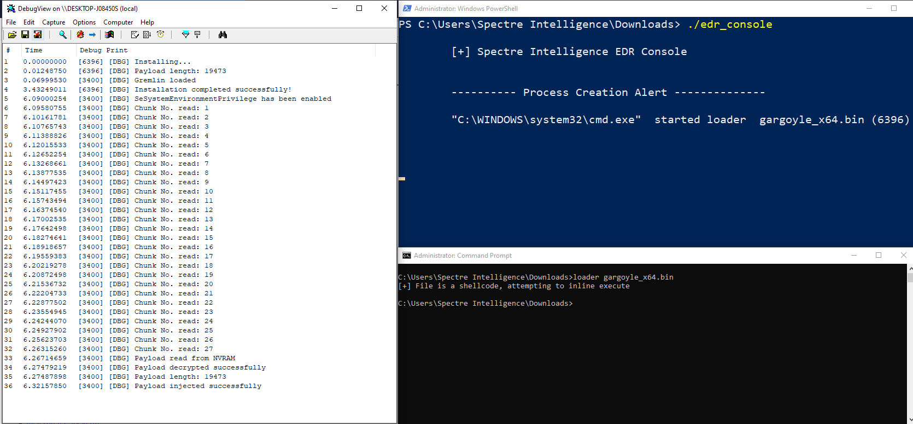
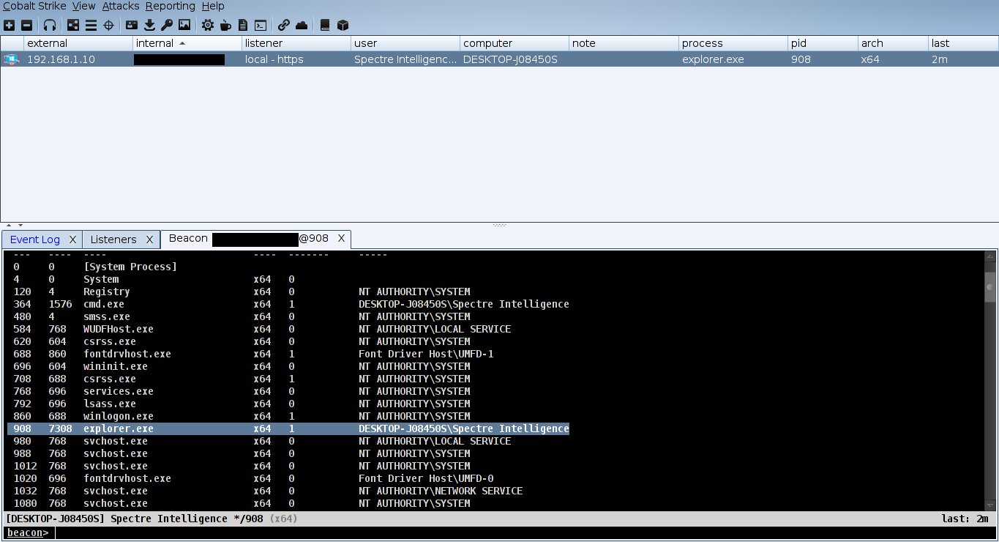
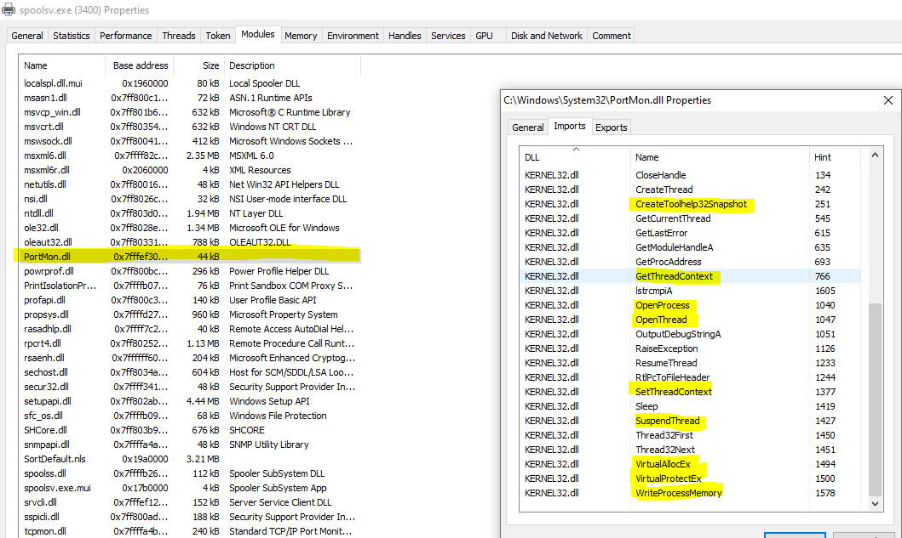
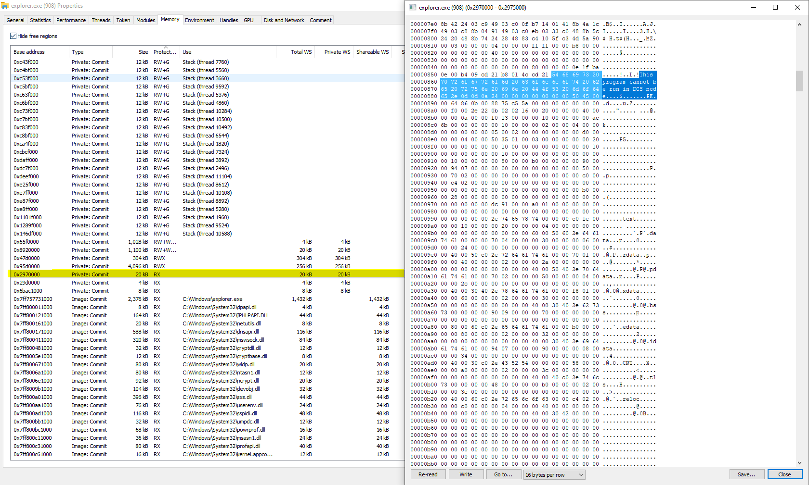
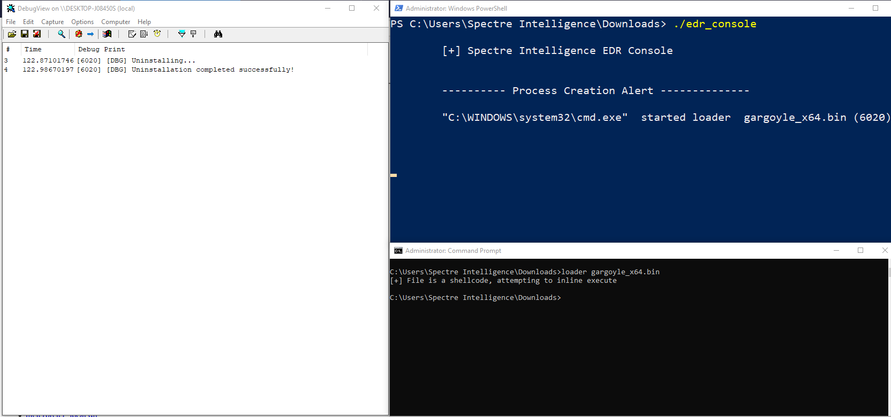

# Introducing MIDNIGHTTRAIN - A Covert Stage-3 Persistence Framework weaponizing UEFI variables

**Reading Time:** _16 minutes_

## TL;DR
This tool is [](https://GitHub.com/Naereen/) for red team operators, offensive security researchers and defenders alike ergo, being made open source and free(as in free beer).

It is available here: [https://github.com/slaeryan/MIDNIGHTTRAIN](https://github.com/slaeryan/MIDNIGHTTRAIN)

Fair warning: This has been made as a small weekend project and while the code has been tested in my lab extensively, bugs are to be expected. Furthermore, I'm not a professional coder so get ready to read crappy code! However, I have given it my best possible efforts and if you find bugs/improvements in the code don't feel shy to contact me!

## Introduction
One of my favourite pastimes is to read APT reports and look for the interesting TTP(Tactics, Techniques and Procedures) used by apex adversaries(Read as: State-backed Threat Groups) in a later attempt to recreate it or at least a variant of it in my lab.

So last Friday was no different, except that this time I was going through the _CIA Vault7_ leaks specifically the _EDB_ branch documents when suddenly [this](https://wikileaks.org/ciav7p1/cms/page_26968084.html) document came to my attention which describes the theory behind NVRAM variables.
Immediately it piqued my interest and I started digging deeper.

Turns out, these variables are not only writable/readable from the user-mode but also it's an awesome place to hide your shit like egress implants, config data, stolen goodies and whatnot which I found out after watching an enlightening [DEFCON talk](https://youtu.be/q2KUufrjoRo), thanks to Topher Timzen and Michael Leibowitz.

In the talk, they do give a demo using C# but the attendees are encouraged to figure out their own way to weaponize this technique.

So it got me thinking of various ways to weaponize this and suddenly I remembered glossing over a report by [ESET](https://www.welivesecurity.com/2019/11/21/deprimon-default-print-monitor-malicious-downloader/) some time back describing an _alleged CIA_ implant(Ironically again!) named **DePriMon** which registered as the default print monitor to achieve persistence on the host(hence the name).

That was the birth of the **MIDNIGHTTRAIN** framework. Over the next two days, I spent time coding it and then a couple of days more for cleaning up and writing this post.

## Of NVRAM variables, Print Monitors, Execution Guardrails with DPAPI, Thread Hijacking etc. oh my my!
For the uninitiated readers, don't be scared of these buzzwords for I can guarantee you that this is absolutely nothing to be scared of and I shall attempt to explain each of these individual components(and the motivation behind it) one by one.

But first, let's go through these basic concepts. 

Initiated readers, feel free to skip this part and move on directly to the framework architecture.

### NVRAM Variables
I am not going to bore you with the theory, for that is not my goal. Just know that all modern UEFI machines use these variables to store important boot-time data and various other vendor-specific data in the flash memory. Needless to say, this data will survive a full reinstallation of the Operating System and to quote the CIA, "are invisible to a forensic image of the hard drive".

Sound like a stealthy place to hide your life's secrets yet?

What's more? As easy as it is to write data into firmware variables from User-mode i.e. Ring 3, it is incredibly difficult(if not downright impossible) for the defenders to enumerate the data from the same.

How so you ask? Well, you'll see in a bit.

Now, conveniently for us attackers, Microsoft provides us with fully-documented API access to the magical land of firmware variables using:

1. [SetFirmwareEnvironmentVariable()](https://docs.microsoft.com/en-us/windows/win32/api/winbase/nf-winbase-setfirmwareenvironmentvariablea) - To create and set the value of an NVRAM variable
```a
BOOL SetFirmwareEnvironmentVariableA(
  LPCSTR lpName,
  LPCSTR lpGuid,
  PVOID  pValue,
  DWORD  nSize
);
```
1. [GetFirmwareEnvironmentVariable()](https://docs.microsoft.com/en-us/windows/win32/api/winbase/nf-winbase-getfirmwareenvironmentvariablea) - To fetch the value of an NVRAM variable
```a
DWORD GetFirmwareEnvironmentVariableA(
  LPCSTR lpName,
  LPCSTR lpGuid,
  PVOID  pBuffer,
  DWORD  nSize
);
```

And if you're wondering what a _Guid_ is, A GUID(Globally Unique Identifier) along with the variable name is just a way to identify the specific variable in question. Therefore, each variable must have a unique name and GUID.

Now does it make sense why it's almost impossible to enumerate from Ring 3? Because enumeration would require the exact name and GUID of the variables. Hell to even verify the existence of a variable, you'd need its specific name and GUID.

Okay, this sounds too good to be true so what's the caveat? Can you call these API's even from a non-elevated context?

Good question, the answer is no! 

Using these API functions require that you are a **local admin** and that you have a specific privilege available and enabled in the calling token namely - `SeSystemEnvironmentPrivilege/SE_SYSTEM_ENVIRONMENT_NAME`. This means that our persistence framework won't install without an **Elevated Context**.(Blue Teams take note!)

I wouldn't consider this a huge problem for attackers since persistence is typically meant to be a Post-Ex job and could be easily installed after privilege escalation on the host.

But the problem doesn't end there. The next big caveat is size. How much data can you store in a single NVRAM variable and how many such variables can be created reliably?

That shall solely dictate what can or can't be used as the payload.

To answer this question, I have done some testing in my lab and I have found that you can approximately create around **50 variables** and each with a capacity of **1000 characters** before Windows starts whining with a **1470** error code.

Also, now is a good time to point out that it is possible to enumerate these variables from **Kernel-mode i.e. Ring 0** using frameworks such as [CHIPSEC](https://github.com/chipsec/chipsec) or using **physical access** to the machine with an **UEFI shell**(Again, Defenders take note!)

### Port Monitors
Once again, I will not bore you with endless theory. But it is important to know a few things. Port Monitors are User-mode DLLs that according to [MSDN](https://docs.microsoft.com/en-us/windows-hardware/drivers/print/port-monitors) "are responsible for providing a communications path between the user-mode print spooler and the kernel-mode port drivers that access I/O port hardware".

These DLLs are loaded by the **Print Spooler Service** or `spoolsv.exe` at startup and for that to happen primarily one of the two methods must be followed:

1. The fully-qualified pathname of the DLL must be written to `HKLM\SYSTEM\CurrentControlSet\Control\Print\Monitors`



This requires either a manual registry entry or via WinAPI and it allows loading of arbitrary DLLs.
1. The second method has a couple of more constraints.

- The DLL must reside in `System32`
- Arbitrary DLLs cannot be loaded via this technique(well, it can but without persistence), the DLL must be written in a [special way](https://docs.microsoft.com/en-us/windows-hardware/drivers/print/port-monitor-server-dll-functions) with some mandatory functions defined and must export a function named `InitializePrintMonitor2` which gets called immediately after the DLL is loaded

Finally, the Port Monitor might be registered via:

[AddMonitor()](https://docs.microsoft.com/en-us/windows/win32/printdocs/addmonitor?redirectedfrom=MSDN) - To  install a local port monitor
```a
BOOL AddMonitor(
  _In_ LPTSTR pName,
  _In_ DWORD  Level,
  _In_ LPBYTE pMonitors
);
```

What the function does under the hood is add the same registry entries and load the DLL within `spoolsv.exe` but without any direct intervention. Readers should probably take note that if the DLL is not created exactly according to MSDN specifications then while the DLL will be loaded for the current session but the appropriate registry entries will **not** be made and the DLL will **not load** after a reboot ergo, defeating its very purpose.

And to uninstall a Port Monitor:

[DeleteMonitor()](https://docs.microsoft.com/en-us/windows/win32/printdocs/deletemonitor) - To remove a local port monitor
```a
BOOL DeleteMonitor(
  _In_ LPTSTR pName,
  _In_ LPTSTR pEnvironment,
  _In_ LPTSTR pMonitorName
);
```

I have chosen the second way for the framework.

### Execution Guardrails with DPAPI
Well, I'm a big fan of putting execution guardrails in my code primarily because of two reasons:

1. To prevent the accidental breaking of the rules of engagement. This will ensure that our malcode doesn't end being executed on any unintended host which are out of the scope
1. To hinder the efforts of blue teams trying to reverse engineer the implant on non-targeted assets and thwart analysis on automated malware sandboxes

Although, I think in this case the latter is more applicable than the former.

So what's DPAPI?

DPAPI(Data Protection API) is simply a set of functions provided by Microsoft intended to ensure confidentiality and integrity of locally stored credentials like Browser passwords, WiFi PSKs etc.

This is primarily achieved through the use of two functions:

1. [CryptProtectData](https://docs.microsoft.com/en-us/windows/win32/api/dpapi/nf-dpapi-cryptprotectdata)
```a
DPAPI_IMP BOOL CryptProtectData(
  DATA_BLOB                 *pDataIn,
  LPCWSTR                   szDataDescr,
  DATA_BLOB                 *pOptionalEntropy,
  PVOID                     pvReserved,
  CRYPTPROTECT_PROMPTSTRUCT *pPromptStruct,
  DWORD                     dwFlags,
  DATA_BLOB                 *pDataOut
);
```
2. [CryptUnprotectData](https://docs.microsoft.com/en-us/windows/win32/api/dpapi/nf-dpapi-cryptunprotectdata)
```a
DPAPI_IMP BOOL CryptUnprotectData(
  DATA_BLOB                 *pDataIn,
  LPWSTR                    *ppszDataDescr,
  DATA_BLOB                 *pOptionalEntropy,
  PVOID                     pvReserved,
  CRYPTPROTECT_PROMPTSTRUCT *pPromptStruct,
  DWORD                     dwFlags,
  DATA_BLOB                 *pDataOut
);
```

Apart from the fact that these functions are quite straightforward to use, it provides another benefit.

If we can encrypt a data blob with DPAPI on the target host, that encrypted data cannot be decrypted anywhere else but on the same host machine. This means that if a payload is encrypted directly on a targeted asset, it shall make decryption and ergo execution non-trivial on a non-targeted asset like a sandbox or say a malware analyst's VM.

I got the inspiration for this from a malware named **InvisiMole**, technical analysis courtesy of [ESET](https://www.welivesecurity.com/wp-content/uploads/2020/06/ESET_InvisiMole.pdf).

You can read in-detail about DPAPI if you're interested [here](https://docs.microsoft.com/en-us/previous-versions/ms995355(v=msdn.10)?redirectedfrom=MSDN#windataprotection-dpapi_topic04).

### Thread Hijacking
Typical code injection uses thread injection using the documented `CreateRemoteThread()` or it's lesser known undocumented cousin `RtlCreateUserThread()` or an Nt* equivalent in Ntdll like `NtCreateThreadEx()`.

What happens in Thread Injection is that a thread is created in the remote process to run our malcode.

Though this remains one of the most popular, easy to implement and stable forms of code injection, this has some disadvantages from an OPSEC perspective. With tools, such as [Get-InjectedThread](https://gist.github.com/jaredcatkinson/23905d34537ce4b5b1818c3e6405c1d2) it is quite easy to detect an injected thread in a remote process by spotting missing `MEM_IMAGE` flags for the memory of the thread start address.

Anyway, this is something that [@xpn(Adam Chester)](https://blog.xpnsec.com/undersanding-and-evading-get-injectedthread/) will do a far better job of explaining than me!

The way Thread Hijacking overcomes the obstacle is by not injecting a thread in the first place but instead hijacking an existing thread of the remote process by first suspending it, then redirecting the `RIP` register to our malcode before resuming the thread again to launch our malcode this time.

This is why it is also fondly known as SiR(Suspend-Inject-Resume) injection. Pretty neat eh?



To accomplish this, we primarily need to perform the following steps(and API calls):

1. [VirtualAllocEx()](https://docs.microsoft.com/en-us/windows/win32/api/memoryapi/nf-memoryapi-virtualallocex) - To allocate memory in the target process for our shellcode
2. [WriteProcessMemory()](https://docs.microsoft.com/en-us/windows/win32/api/memoryapi/nf-memoryapi-writeprocessmemory) - To write the shellcode to the allocated memory in the target process
3. [SuspendThread()](https://docs.microsoft.com/en-us/windows/win32/api/processthreadsapi/nf-processthreadsapi-suspendthread) - To suspend a thread
4. [GetThreadContext()](https://docs.microsoft.com/en-us/windows/win32/api/processthreadsapi/nf-processthreadsapi-getthreadcontext) - To fetch the current state of the registers for our hijacked thread
5. [SetThreadContext()](https://docs.microsoft.com/en-us/windows/win32/api/processthreadsapi/nf-processthreadsapi-setthreadcontext) - To set the updated state of the registers for our hijacked thread specifically the RIP register now redirected to point to our shellcode
6. [ResumeThread()](https://docs.microsoft.com/en-us/windows/win32/api/processthreadsapi/nf-processthreadsapi-resumethread) - To resume the hijacked thread

There's an extra [VirtualProtectEx()](https://docs.microsoft.com/en-us/windows/win32/api/memoryapi/nf-memoryapi-virtualprotectex) call which I have taken the liberty to add because well, for one allocating `RWX` memory in a remote process is not taken too kindly by PSPs.

The workaround first allocates `RW` pages for writing the payload and later changes the page protection to `RX` before the thread is resumed so that the payload can be executed.

One last thing to note regarding this method is that it is a little unstable and the chances of the target process crashing after the malcode terminates are extremely high! (requires cleanup to fix)

A possible alternative might include creating a new process and hijacking that but I wanted to avoid a process creation event(Sysmon Event ID 1). Ideally, you should weigh your pros and cons taking into factor your target environment and edit the code to suit your needs.

## Enter MIDNIGHTTRAIN
Whatever you've read till now explains the **What?**. Now that we have more-or-less understood the individual pieces of the puzzle let's move forward and assemble the above pieces to solve the puzzle and try to explain the **How?**.

But first, let us look at a block diagram to help visualize the architecture.


So as we can see underlined in the diagram, this framework consists of two payloads:

1. `Gremlin` - The Port Monitor DLL
2. `Gargoyle` - The Persistence Installer

Both of them are compiled to DLLs and with the Gargoyle payload an extra step is taken to convert it into a PIC(Position Independent Code) blob, big thanks to [(@monoxgas)Nick Landers[SBS]](https://twitter.com/monoxgas) for the amazing [sRDI project](https://github.com/monoxgas/sRDI).

This is done to ensure that persistence can be delivered via your favourite C2 framework and installed with **inline execution/local execution** of shellcode.

When `Gargoyle` is executed in-memory in an **Elevated Context** it primarily has **two** objectives to accomplish:

1. Figure out if persistence is already installed on the host or not. If not:
- Extract `Gremlin` implant DLL from its resource section and copy it to `System32` folder before installing it as a Port Monitor DLL using the above-mentioned method
- Extract the Beaconing shellcode payload from its resource section, encrypt the payload using DPAPI on the target host, `Base64URL` encode the encrypted payload and divide it into chunks before writing them into as many NVRAM variables as permissible by the flash chip
2. If persistence is already installed on the host:
- Delete the `Gremlin` implant from `System32`
- Unload `Gremlin` implant from `spoolsv.exe`
- Delete the payload from the NVRAM variables

This is turn loads `Gremlin` implant by `spoolsv.exe` if persistence is installed successfully which has the following objectives to accomplish:

1. Steal a token from `winlogon.exe` and impersonate for the current thread(more on this later)
2. Check if `SeSystemEnvironmentPrivilege/SE_SYSTEM_ENVIRONMENT_NAME` is available in the token and enable it if available
3. Now, read back the individual chunks from the NVRAM variables and assemble to get the Base64URL-encoded encrypted payload
4. `Base64URL` decode it to get the encrypted payload byte blob
5. Decrypt the blob using DPAPI to get the final payload
6. Hijack a thread of `explorer.exe` to execute our Beaconing payload(`Meterpreter`/`Beacon`/`Grunt` etc.)

## Design Considerations and OPSEC Concerns
If you came this far, you must have a lot of questions regarding this framework. Don't worry for now I shall attempt to address some of those and discuss some OPSEC concerns. Hopefully, that shall explain the **Why?**.

First, let's address the issue with UEFI variables. 

By now, it is pretty evident that we can do little with the buffer space offered by one NVRAM variable. Therefore, we need to chunk the payload into the max permissible size and write those individual chunks to as many variables as required and permissible. Like I said before, I have found out from my tests that we can create a maximum of **50 variables and each with a buffer space of 1000 characters**. Our next quest is to figure out what encoding scheme to use to store the payload byte blob. It needs to be an efficient one for us to utilize the most out of the buffer space. `hex` will take two characters for each byte while `Base64` takes 4 characters for every 3 bytes, so it's more efficient than `hex`. But can we do any better? Yes, we can! And one of the ways is by using `Base64URL` which is an URL-safe variant of `Base64` encoding plus omitting the padding character(=).

So what's the final size of the payload that we can reliably store in NVRAM? It comes as around `~36 kB`.
It becomes immediately evident to us that **Stageless payloads generated out-of-the-box** are out of the question with this tiny size limit in today's age.

So what can we use? Well, **Staged payloads generated out-of-the-box** should work fine with this framework. But this potentially raises an OPSEC concern since using default `Beacon` stagers is not recommended. And what about the cases when even the Staged payload crosses the size limit? 

**Taking into consideration all these factors, I recommend designing a simple native payload stager/loader yourself that fetches the final payload over a network(due to size constraints) and executes it locally. In that case, there would be no need to inject it again since the egress implant is already in the address space of a process from where network activity is not considered unusual by PSPs**.

Secondly, some of you might be wondering if we are touching disk anyways with the `Gremlin` implant then why do we need NVRAM variables and why do we even need a separate persistence payload for that matter? Shouldn't persistence be a part of the Stage-1 or Stage-2 RAT?

Short Answer: OPSEC



Long Answer: Sure, **persistence has to touch disk but we can always minimize the impact of that by controlling what touches the disk and what stays in-memory only**. A `Stage-1(Beaconing)` or a `Stage-2(Post-Exploitation)` RAT **on disk** is **just asking to be caught by AV/EDRs**. They have **no** business being **on disk** and they should reside **in-memory only**. But with that comes a problem. If they are in-memory only, how can we possibly achieve persistence with them? That answer is a **"relatively-benign" persistence implant that automatically loads at machine startup which in turn loads the egress implant in-memory**. So how does the persistence implant(in our case `Gremlin` - A Port Monitor DLL) fetch the egress implant? There are possibly two avenues here: 
1. Either over network or better yet
2. A stealthy storage place in Windows
One of those covert storage compartments happens to be **NVRAM Variables**. Some other possible places to hide your shit could be **NTFS ADS(Alternate Data Streams), Windows Registry, Event Logs** etc.

I simply chose UEFI variables because well it seemed more fun than the rest and since (ab)using them for covert data storage requires elevation anyways, I decided to use a Port Monitor DLL as the persistence implant which is loaded by `spoolsv.exe` which if you haven't noticed is a `SYSTEM` process so it just all fit together nicely :)

One last thing I feel like I should point out is that although `spoolsv.exe` runs as `SYSTEM`, it doesn't have the privilege required to use NVRAM variables in its process token. Ergo, we have to perform token stealing a.k.a. `Token Impersonation` to impersonate a token with the required privilege for the current thread and then attempt to enable the privilege.

Hopefully, with this, I was able to explain the motivation behind each design choice.

## Screenshots
Time for screenshots!

Installing persistence:



And we successfully caught an incoming `Beacon` shell:



Inspecting loaded modules in `spoolsv.exe`:


Some pretty _suspicious_ functions in the import table here, wonder what this module is hmmm.

This is the actual `Beacon` stager shellcode used:


Aaah! That familiar PE DOS stub!

Uninstalling persistence:



## Conclusion
If you're still reading, I want to thank you for having the patience to read the whole article. I hope you enjoyed reading it as much as I enjoyed designing the framework/writing this blog post.

Keep in mind that the framework has been designed in a **very modular structure** so that operators can easily mix and match other techniques keeping the architecture same or just treat it as separate modules and use them in their own projects.

Feel free to hit me up if you feel something could be improved/general suggestions/other cool ideas etc.

You can find what I'm up to on my Twitter [@slaeryan](https://twitter.com/slaeryan/).

Bene vale operator!

## Credits
1. [https://github.com/perturbed-platypus](https://github.com/perturbed-platypus) - Big thanks to [@TTimzen](https://twitter.com/ttimzen?lang=en) & [@r00tkillah](https://twitter.com/r00tkillah?lang=en) for the wonderful research
2. [https://gist.github.com/jthuraisamy/e602d5d870230df3ce00178001f9ac16](https://gist.github.com/jthuraisamy/e602d5d870230df3ce00178001f9ac16) - Another PoC thanks to [@Jackson_T](https://twitter.com/jackson_t?lang=en)
3. [@am0nsec](https://twitter.com/am0nsec?lang=en) for dropping dem hints regarding the token impersonation
4. [Dark Side Ops - 1](https://silentbreaksecurity.com/training/malware-dev/) - A highly recommended hands-on approach to implant development from some of the best people in the game, highly recommended course
5. [CIA Vault7 leaks](https://wikileaks.org/ciav7p1/cms/page_31227915.html) - I have a joke but its [REDACTED]
6. 

## Support this project
If you find this project useful, consider buying me coffee or a beer(depending on the mood) as a token of appreciation.

You can do it right here:

<a href="https://www.patreon.com/bePatron?u=33751219" data-patreon-widget-type="become-patron-button">Become a Patron!</a><script async src="https://c6.patreon.com/becomePatronButton.bundle.js"></script>

OR

<div>
  <a class="donate-with-crypto"
     href="https://commerce.coinbase.com/checkout/860e4301-3c92-40df-b181-3d23ec3db910">
    Donate with Crypto
  </a>
  <script src="https://commerce.coinbase.com/v1/checkout.js?version=201807">
  </script>
</div>

<br />

<div id="disqus_thread"></div>
<script>

/**
*  RECOMMENDED CONFIGURATION VARIABLES: EDIT AND UNCOMMENT THE SECTION BELOW TO INSERT DYNAMIC VALUES FROM YOUR PLATFORM OR CMS.
*  LEARN WHY DEFINING THESE VARIABLES IS IMPORTANT: https://disqus.com/admin/universalcode/#configuration-variables*/
/*
var disqus_config = function () {
this.page.url = https://slaeryan.github.io;  // Replace PAGE_URL with your page's canonical URL variable
this.page.identifier = 9; // Replace PAGE_IDENTIFIER with your page's unique identifier variable
};
*/
(function() { // DON'T EDIT BELOW THIS LINE
var d = document, s = d.createElement('script');
s.src = 'https://https-slaeryan-github-io.disqus.com/embed.js';
s.setAttribute('data-timestamp', +new Date());
(d.head || d.body).appendChild(s);
})();
</script>
<noscript>Please enable JavaScript to view the <a href="https://disqus.com/?ref_noscript">comments powered by Disqus.</a></noscript>
