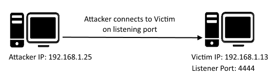

# SLAE Exam Assignment 1 - Creating a Bind TCP shellcode

## Prologue
The first assignment for the SLAE certification exam is creating a Bind TCP shellcode for Linux/x86 architecture using the shellcoding knowledge that we have accumulated from the SLAE course and from our self-learning process.

So without any further ado, let's get down with it shall we?

## So what is Bind TCP anyway?
Let's take a look at a visual representation first and then we shall get down to the details.

As is illustrated by the image, the victim/target machine opens a port and listens for an incoming connection request by the attacker. After a connection is established between them, the target can execute any abritary command as instructed by the target machine.

In other words, the victim is running the TCP server and the attacker is running the TCP client code.

An important point to remember is that this whole situation **reverses in a Reverse TCP shell.**

So how is this useful in the context of Information Security?

Honestly, bind shells are not that useful in a pen-testing scenario because for one firewalls have very strict inbound traffic filtering rules so inbound traffic from an unknown attacker's IP will probably be blocked and the shell won't be functioning. A Reverse TCP shell is what we use almost always in a pen-testing engagement as a workaround for this problem. You can find more information about this in the next blog post.

## A C Prototype first
If we are going to program in something as low-level as machine code it is only fair that we first create a prototype in a high-level language like C/C++ to conceptualize it and get a template for creating our assembly code right?

