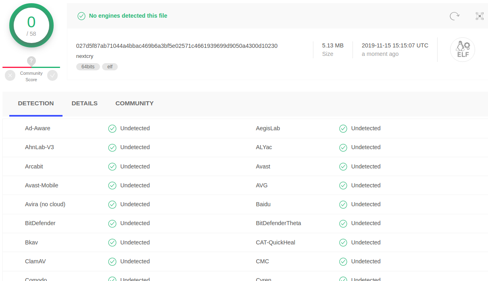

# SLAE Exam Assignment 7 - Creating a custom shellcode crypter

## Prologue
After an absolutely amazing journey that was the x86 Assembly Language and Shellcoding on Linux course brought to us by our instructor Vivek Ramachandran and Pentester Academy, this is the last but definetely not the least enjoyable assignment that we had to do for our SLAE certification i.e. create a custom shellcode crypter that will allow us to bypass AV/EDR signatures.

For this assignment, we could use any programming language of our choice and I chose **Python3**(Hey! why not?) simply beacause it's a breeze to create prototypes in Python before finally implementing it in some language like C/C++. 

So what are we waiting for? Let's get down with it!

## But let's talk about encryption first!
So a question might pop in your heads that is why do we use encryption in the context of payloads, malwares yada yada yada?

All existing malware detection products rely on some form of _static-analysis_ which is basically extracting some signatures from an unknown executable and comparing it to a huge database of known signatures of "bad" programs to determine it's nature before it is ever run on the machine.

To better understand it, let's look at something.

So this is how a standard meterpreter shell looks without any form of encryption when scanned with different AV products. Nearly all AVs possess the ability to catch and quarantine them almost immediately. Hmmmm...

But what if we encrypt the executable? 

And run the executable by decrypting it successfully at run-time? It's a brilliant idea right? Kudos to whoever thought of that!

The main theme here is to encrypt the executable ahead of time and insert a piece of code that will do the decryption at runtime and execute our payload thereby bypassing static signature-based detection successfully because that happens pre-execution remember?

This is how an encrypted payload looks exposed to VirusTotal.

An important point to note is that using this technique we will only be able to bypass AVs relying on _static-analysis_ solely which is seldom the case nowadays since security products today use a hybrid technique of _static-analysis_ and _dynamic-analysis_ combined which is basically automatic execution of the binary in a secure environment and looking for suspicious behaviours/indicators to determine whether it is malicious or not and this going to catch our payload once we decrypt the payload.

Of course there are workarounds for this too but those are the topics of another discussion.

## Implementation details
So we are going to be using a cryptographic library known as NaCl which is an abbreviation for is an abbreviation for "Networking and Cryptography library" as the principal encryption library for our crypter.

Fortunately for us, since this library was created by a very well-known mathematician and cryptographer known as D.J. Bernstein, we do not need to worry about the security or the mathematical backend of this library and we can move on directly with the practical aspects of it.
